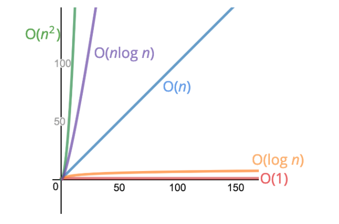

# Big O tips

## Simplifying Big O Expressions (Time complexity)

> When determining the time complexity of an algorithm, there are some helpful rule of thumbs for big O expressions.
>These rules of thumb are consequences of the definition of big O notation.

### Constants Don't Matter

* O(2n) can be simplified to O(n)

* O(500) can be simplified to O(1)

* O(13n²) can be simplified to O(n²)

### Smaller Terms Don't Matter

* O(n + 10) can be simplified to O(n)
* O(1000n + 50) can be simplified to O(n)
* O(n² + 5n + 8) can be simplified to O(n²)

### Big O Shorthands

* Arithmetic operations are constant
* Variable assignment is constant
* Accessing elements in an array (by index) or object (by key)
  is constant
* In a loop, the complexity is the length of the loop times
  the complexity of whatever happens inside of the loop

## Using big O to analyse space complexity (refers to the auxiliary space complexity uses by algorithm, not including space taken by inputs)

### Space complexity in JS (Rules of Thumb)

* Most primitives (booleans, numbers, undefined, null) are constant Space
* String require O(n) space (where n is the string length)
* Reference types are generally O(n), where n is the length (for arrays)
  or the number of keys (for objects)

## Logarithms complexity

> log₂(value) = exponent ---> 2exponent = value
> In this we can take log === log2

### The logarithm of a number roughly measures the number of times you can divide that number by 2 before you get a value that's less than or equal to one.

